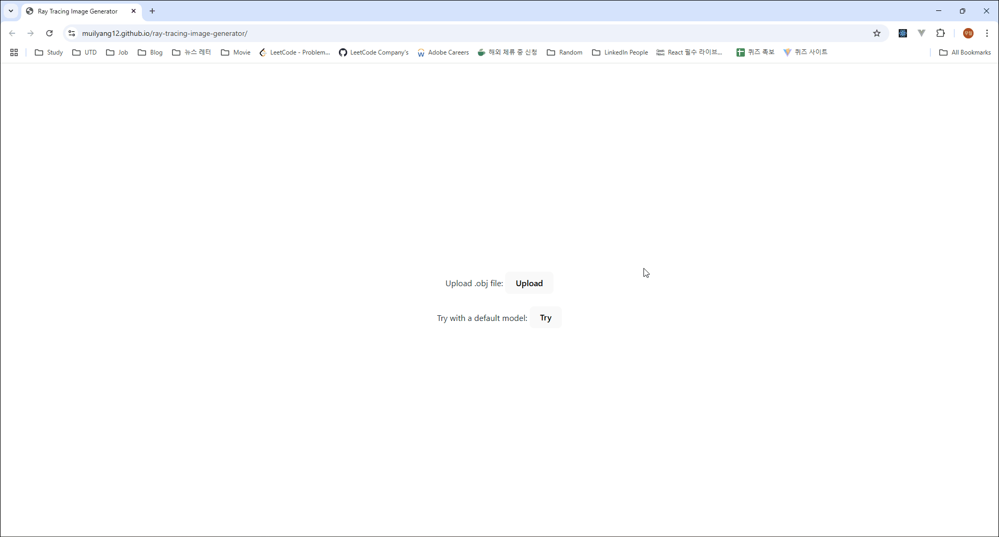

# Ray Tracing Image Generator

## Overview

This project is a WebAssembly-powered ray tracing image generator built using C++ and integrated into a React + Three.js frontend. You can upload `.obj` files or use a default model to generate ray-traced images directly in the browser.

**🔗 Live Demo:** [https://muilyang12.github.io/ray-tracing-image-generator/](https://muilyang12.github.io/ray-tracing-image-generator/)

<br />

## Demo Video

<div align="center">
    
</div>

<br />

## Technologies Used

- C++ (Ray tracing core logic)
- WebAssembly (WASM) via Emscripten
- React
- Three.js (for UI interaction)
- Zustand (for state management)

<br />

## Setup Guide

Follow the steps below to build and run the project locally.

### Step 1. Clone the Repository

```bash
git clone https://github.com/your-username/ray-tracing-image-generator.git
cd ray-tracing-image-generator
```

### Step 2. Install Emscripten SDK

```bash
git clone https://github.com/emscripten-core/emsdk.git
cd emsdk
./emsdk install latest
./emsdk activate latest
source ./emsdk_env.bat
```

### Step 3. Build WASM Module

```bash
emcc ../ray-tracing/main.cpp ../ray-tracing/BVHTree.cpp ../ray-tracing/Scene.cpp ../ray-tracing/RayTracer.cpp ../ray-tracing/Renderer.cpp -O3 -s EXPORTED_RUNTIME_METHODS=['FS'] -s WASM=1 -s MODULARIZE=1 -s EXPORT_ES6=1 -s ALLOW_MEMORY_GROWTH=1 -s EXPORT_NAME="RayTracingFactory" --bind -o ../src/wasm/ray-tracing.js
```

### Step 4. Run the Development Server

```bash
cd ../
npm install
npm run dev
```
